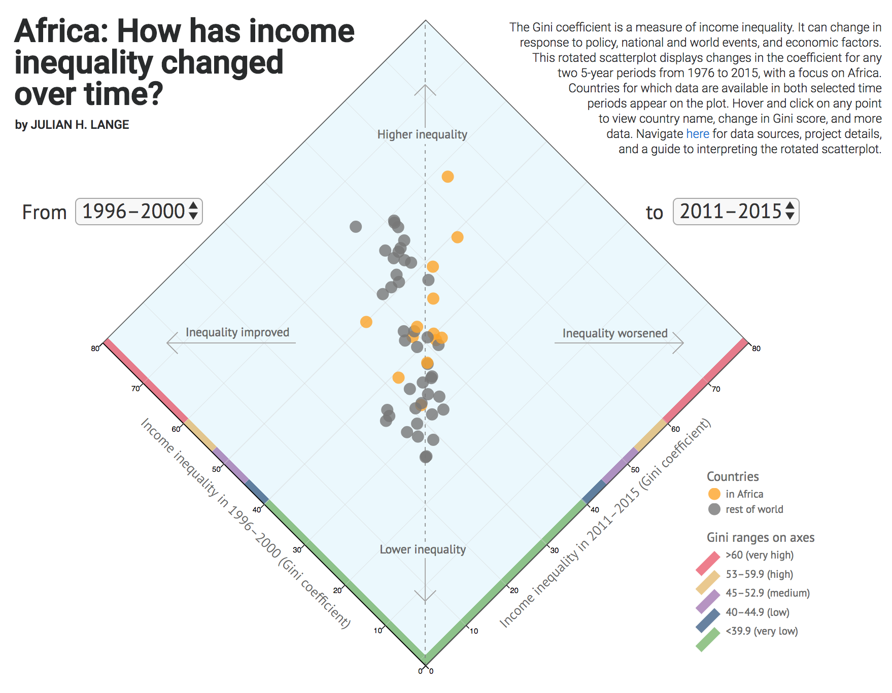

# How has income inequality changed over time in Africa?

### Abstract
The Gini coefficient is a measure of income inequality. The coefficient can change in response to policy decisions, national and international events, and economic factors.
Line charts that visualize changes in the Gini score over time for many countries are challenging to read because many lines crossing paths are difficult to follow.
This scatter plot displays changes in the Gini coefficient between any two periods for all countries for which data are available in those two 5-year periods.

### Why diamond-shaped?
Scatter plots are traditionally shown as a square face-on. By rotating the scatter plot by 45 degrees to a diamond, the important information –
improving or worsening inequlity - is easily discernible by a point's position to the left or right of the vertical dotted line.

### Features
* Select any two 5-year periods between 1976 and 2015 to view the changes in Gini coefficient for all countries for which data are available
* On the scatter plot, click on a country's dot to view all available data for that country between 1976 and 2015

### Credits
Created by [Julian H. Lange](https://www.julianhlange.com) with data from the following sources:

* Gini data are from The World Bank World Development Indicators. Retrieved October 2017 from [data.worldbank.org](https://data.worldbank.org/data-catalog/world-development-indicators).
* Data were processed with R version 3.3.1. Retrieved from [http://www.r-project.org](http://www.r-project.org). For each 5-year period, the latest Gini score was chosen.