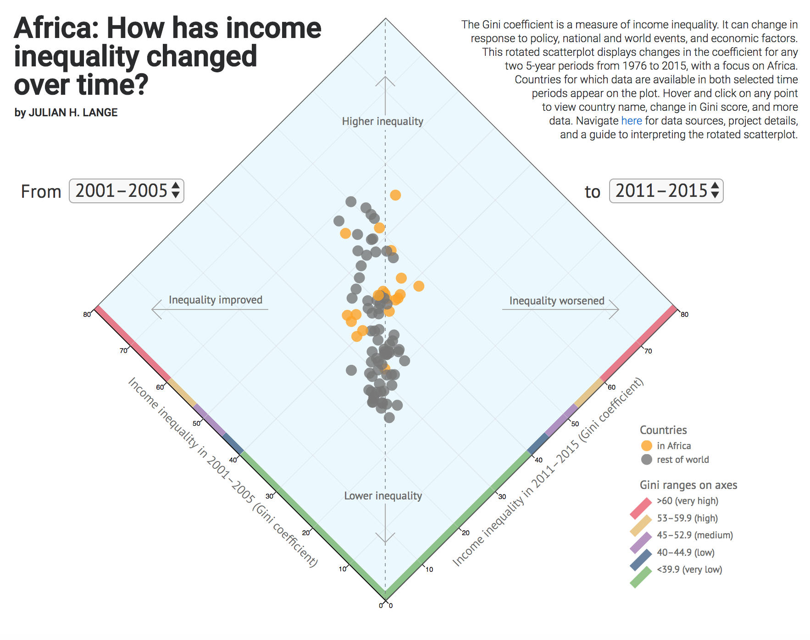

# Africa: How has income inequality changed over time?

### Abstract
The Gini coefficient measures a nation's income inequality and ranges from 0 (full equality) to 100 (complete inequality).
Its value can change in response to policy decisions, societal factors, and critical events such as civil war and recession.
Time-series line charts that visualize changes in the Gini value for many countries can be challenging to digest when lines intersect
and cross paths. This rotated scatterplot displays changes in the Gini coefficient between any two 5-year time periods for all countries
for which data are available in those two periods. Recent research conducted by the United Nations Development Programme Regional Bureau
for Africa and documented in "Income Inequality Trends in sub-Saharan Africa: Divergence, Determinants, and Consequences" identified the
drivers of income inequality in African countries. This visualization highlights African countries and compares them with the rest of the world.

### Guide to reading the plot
Scatterplots are traditionally shown as face-on squares. By rotating this scatterplot 45 degrees to a diamond shape, the important result
– the answer to the question: has income inequality improved or worsened in the intervening years? – is more easily discernible. Each point represents
one country's data for the two selected time periods. Its position to the left or right of the vertical dotted line is informative as follows:
* Countries to the left: the Gini score decreased, signaling an improvement in income inequality in these countries.
* Countries to the right: the Gini score increased, indicating that income inequality has worsened in these countries.
* Countries with higher income inequality appear in the top half of the plot; those with lower income inequality are in the bottom half.
* The ideal position is bottom left, which indicates low income inequality in the first 5-year period and a further decrease in the second 5-year period.

### Features
* Select any two 5-year periods between 1976–1980 and 2011–2015 to view changes in the Gini coefficient for all countries for which data are available.
* On the rotated scatterplot, hover on each point to see the country and change in Gini value between the two selected time periods.
* Click on a country's point to view a pop-up conventional scatterplot showing data for that specific country.

### Credits
Created by [Julian H. Lange](https://www.julianhlange.com) in partnership with the UNDP Regional Bureau for Africa and with data from the following sources:
* Gini data are from World Bank World Development Indicators (WDI). Retrieved October 2017 from [data.worldbank.org](https://data.worldbank.org/data-catalog/world-development-indicators).
* Gini ranges are defined in the UNDP Regional Bureau for Africa study [Income Inequality Trends in sub-Saharan Africa: Divergence, Determinants, and Consequences](http://www.africa.undp.org/content/rba/en/home/library/reports/income-inequality-trends-in-sub-saharan-africa--divergence--dete.html").
* Data were processed with R version 3.3.1. Retrieved from [http://www.r-project.org](https://www.r-project.org).
If two or more Gini scores were available for a country in a 5-year period, the latest Gini score was selected.
* The visualization was made with [D3.js version 4](https://d3js.org).